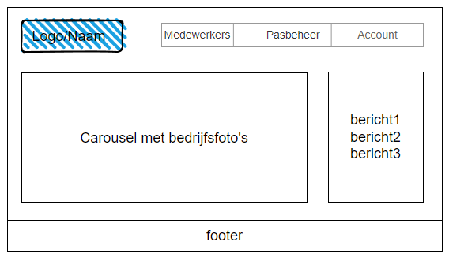
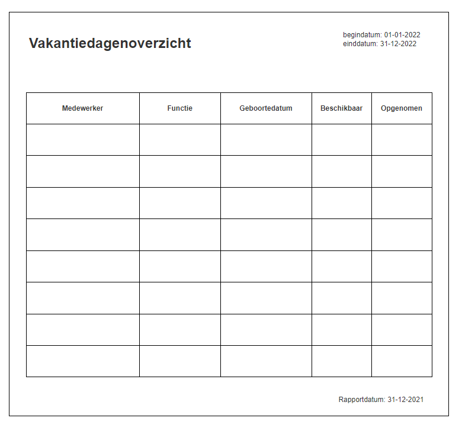

# Functioneel Ontwerp

[naam applicatie]

| Versie        |   |
|---------------|---|
| Datum         |   |
| Naam          |   |
| Studentnummer |   |

# Inhoud

1. [Inleiding](#inleiding)
2. [Functionaliteiten](#functionaliteiten)
3. [User Interface](#user-interface)
4. [Rapportages](#rapportages)

## Inleiding

*Schrijf hier een korte inleiding over het programma. Denk bijvoorbeeld aan de volgende punten:*

-   Voor welk bedrijf wordt het programma gemaakt
-   Waarom wordt het programma gemaakt
-   Welke doelgroep gaat het programma gebruiken (klanten, medewerkers, Internetgebruikers, enzovoort)
-   Wat voor soort programma maak je (webapplicatie, desktopapplicatie, mobile app, enzovoort

## Functionaliteiten

*Hier beschrijf hier in het kort welke functionaliteiten in het programma moeten komen. Dus wat je met het programma kan doen.*

*De lijst met functionaliteiten kan je verder uitwerken in userstories.*

-   De rollen in de applicatie zijn **admin, manager** en **medewerker**
-   Beheren van medewerkers (lijst, invoeren, wijzigen, verwijderen)

**User stories**

## User Interface

*Hier beschrijf je hoe de user interface eruit komt te zien. Je mag zogenaamde wireframes gebruiken of gedetaileerde plaatjes van de vensters en pagina’s*

*Wireframes zijn geschikt voor een algemene indruk van bijvoorbeeld een website.*

**Voorbeeld:**

**Wireframe hoofdpagina**

## Rapportages

[*Hier beschrijf je welke rapportages/uitvoer het programma levert. Je beschrijft welke informatie op het rapport te zien moet zijn.*

*Je mag hier ook weer een wireframe/plaatje gebruiken om te laten zien hoe het rapport eruit moet komen te zien.*

**Voorbeeld:**

**Vakantiedagenoverzicht**

Het medewerkersoverzicht is een lijst met medewerkers met de volgende informatie:

-   Begin- einddatum periode
-   Rapportdatum
-   Voornaam, achternaam, functie en geboortedatum
-   Beschikbare vakantiedagen/Opgenomen vakantiedagen

