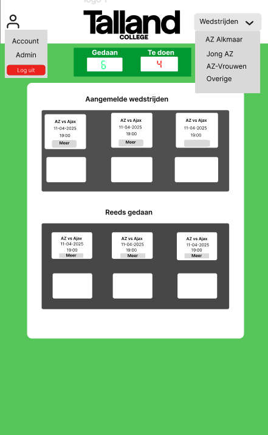
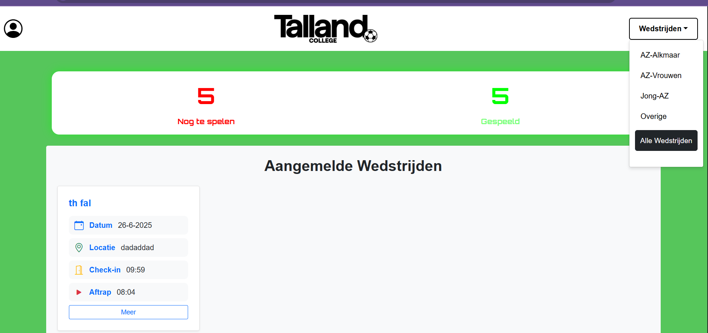

# Functioneel Ontwerp

Beveiligingswedstrijden Applicatie

| Versie        | 1.0      |
| ------------- | -------- |
| Datum         | [vul in] |
| Naam          | [Appie Khalid] |
| Studentnummer | [174663] |
| Naam          | [Appie Khalid] |
| Studentnummer | [174663] |

# Inhoud

1. [Inleiding](#inleiding)
2. [Functionaliteiten](#functionaliteiten)
3. [User Interface](#user-interface)
4. [Rapportages](#rapportages)

## Inleiding

Deze applicatie is gemaakt voor de opleiding Handhaving. Studenten van deze opleiding moeten stage lopen als beveiliger bij evenementen zoals sportwedstrijden. De applicatie is ontwikkeld om het aan- en afmelden voor deze wedstrijden te faciliteren, en om het beheer voor docenten (admins) eenvoudiger te maken.

- De applicatie is bedoeld voor onderwijsinstellingen met een handhavingsopleiding.
- Het programma wordt gemaakt om het proces van stagetoewijzing en aanwezigheidsregistratie te verbeteren.
- De doelgroep bestaat uit studenten en docenten van de opleiding.
- De applicatie is een webapplicatie die toegankelijk is via internet.

## Functionaliteiten

De applicatie kent twee rollen: **admin (docent)** en **student**.

**Admins kunnen:**

- Wedstrijden toevoegen, bewerken en verwijderen
- Klassen (groepen) aanmaken, wijzigen en verwijderen
- Studenten toevoegen, bewerken en verwijderen

**Studenten kunnen:**

- Zich aanmelden voor wedstrijden
- Zich afmelden voor wedstrijden
- Wedstrijden ruilen met andere studenten

### Requirements

- Als docent wil ik eenvoudig wedstrijden kunnen toevoegen, starttijden kunnen aanpassen en opmerkingen kunnen plaatsen.
- Als student wil ik mij kunnen aanmelden voor een wedstrijd zodat ik weet waar ik stage loop.
- Als gebruiker wil ik me kunnen afmelden zodat ik niet aangemeld sta voor een wedstrijd die ik niet red
- Als student wil ik een wedstrijd kunnen ruilen, zodat ik flexibel ben als ik een keer niet kan

## User Interface

De interface is ontworpen om eenvoudig en overzichtelijk te zijn, zowel voor studenten als admins.

### Wireframe home

### Resultaat

###

## Rapportages

De applicatie levert een aantal rapportages voor admins:

### Aanwezigheidsrapport

Een overzicht van wie zich heeft aangemeld, wie is afgemeld, en wie aanwezig was bij de wedstrijden.

- Wedstrijdnaam
- Datum en tijd
- Locatie
- Aangemelde studenten
- Aanwezigheidsstatus

### Klassenoverzicht

Een lijst van alle studenten per klas met hun aanmeldstatus:

- Klasnaam
- Studentnamen
- Aantal wedstrijden waarvoor aangemeld
- Aantal keer afgemeld
- Aantal keer aanwezig

###
