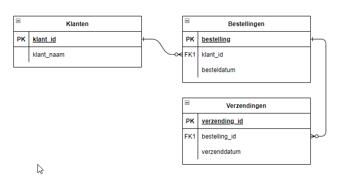

# Technisch Ontwerp

[naam applicatie]

| Versie        |   |
|---------------|---|
| Datum         |   |
| Naam          |   |
| Studentnummer |   |

# Inhoud
1. [Inleiding](#inleiding)
2. [Functionaliteiten](#functionaliteiten)
3. [Klassendiagram](#klassendiagram)
4. [Datamodel](#datamodel)
5. [ERD](#entiteit-relationship-diagram-erd)
6. [Data-Dictionary](#datadictionary)
7. [Oplevering](#oplevering)

## Inleiding

*Schrijf hier een korte inleiding over het programma. Denk bijvoorbeeld aan de volgende punten:*

-   Voor welk bedrijf wordt het programma gemaakt
-   Waarom wordt het programma gemaakt
-   Welke doelgroep gaat het programma gebruiken (klanten, medewerkers, Internetgebruikers, enzovoort)
-   Wat voor soort programma maak je (webapplicatie, desktopapplicatie, mobile app, enzovoort

**Voorbeeld**

Dit is het technische ontwerp voor het nieuwe administratieprogramma van Bakker Bartels. Deze applicatie gaat het bestaande desktop programma vervangen.

De applicatie gaat gebruikt worden door de administratieafdeling van het bedrijf.

Er wordt een webapplicatie gemaakt die ook op een mobiel goed te gebruiken moet zijn.

## Functionaliteiten

*Maak een lijst met de functionaliteiten uit het functioneel ontwerp of je opdracht.*

*Als er bijzonderheden zijn dan beschrijf je die ook.*

**Voorbeeld**

-   Invoeren van nieuwe medewerkers
-   Wijzigen medewerkers
-   Verwijderen medewerkers
    -   Bij het verwijderen van de medewerker wordt ook de pas geblokkeerd

## Klassendiagram

*Hier beschrijf je hoe de klassen van je programma eruitzien en met elkaar samenhangen. Je kan dit doen met behulp van een diagram of door een beschrijving van de classes, de methods en eigenschappen.*

**Voorbeeld**

# Datamodel

## Entiteit Relationship Diagram (ERD)

*voeg hier een schema in van het datamodel. Maak voor elke tabel een blokje en geef met lijnen weer hoe de tabellen met elkaar verbonden zijn*

**Voorbeeld**

## Datadictionary

*Voeg hier een lijst in met per tabel een opsomming van de gebruikte kolommen. Per kolom geeft je weer: de naam, het datatype, de lengte, of het een sleutel is en zoja naar welke tabel.]*

**Voorbeeld**

| **medewerker** |              |            |         |                  |
|----------------|--------------|------------|---------|------------------|
| **Kolom**      | **Datatype** | **Lengte** | **Key** | **Relatie naar** |
| Id             | integer      |            | Primary |                  |
| rol_id         | integer      |            | Foreign | Rollen           |
| voornaam       | string       | 200        |         |                  |
| achternaam     | string       | 200        |         |                  |
| voorvoegsel    | string       | 20         |         |                  |

## Oplevering

*Beschrijf hier wat er gedaan moet worden om de applicatie op te leveren in een productieomgeving. De onderwerpen zijn per applicatie verschillend. Denk onder andere aan de volgende onderwerpen:*

-   Welke server wordt gebruikt, naam, versie, installatiestappen
-   Welke databaseserver wordt gebruikt, naam, versie, installatiestappen
-   Welke webserver wordt gebruikt
-   Welke ontwikkelplatform is gebruikt (PHP, .NET, JavaScript, enz.)
-   Welke framework is gebruikt (Laravel, ASP.NET, React, Angular, enz.)
-   Welke firewall is geïnstalleerd
-   Welke poorten zijn beschikbaar
